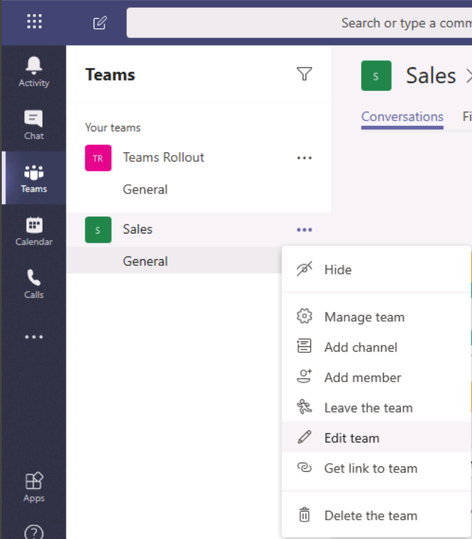
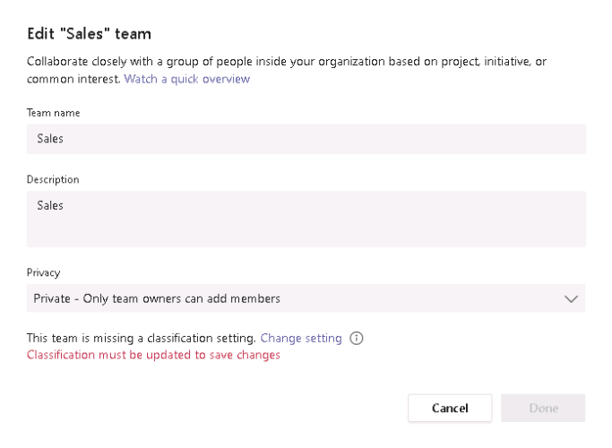
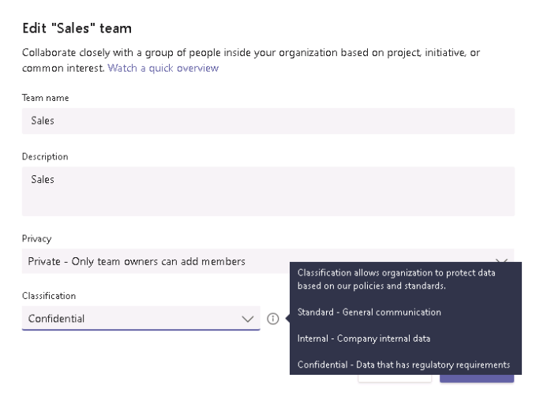
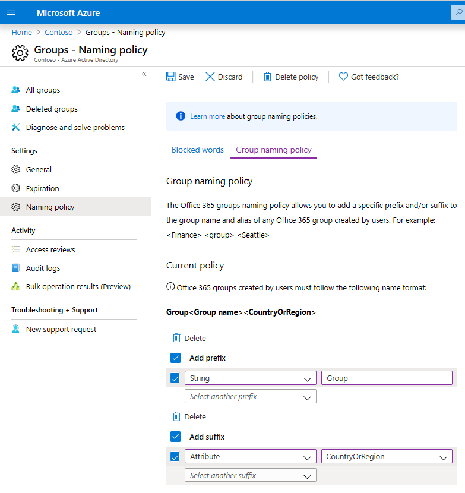

--- 
lab: 
    title: 'Lab: Configure Security and Compliance for teams and content '
    module: 'Module 02: Implement Microsoft Teams Governance, Security and Compliance' 
---

# Lab 02: Configure Security and Compliance for teams and content
# Student lab manual
## Lab Scenario  

In the labs of this course you will assume the role of Joni Sherman, a System Administrator for Contoso Ltd. Your organization is planning to deploy Microsoft Teams. Before starting the deployment, IT department is gathering business requirements about Teams governance as well as data security and compliance, including how the data shared in Teams be regulated according to the organization's compliance requirements. After you complete the planning process, you will configure Office 365 Groups governance, protect Teams from threats, and configure Teams to meet your organization compliance requirements.

## Objectives

After you complete this lab, you will be able to:

- Create classification labels
- Configure expiration policies
- Restrict creation of new teams to members of a security group
- Create naming policies
- Reset all Azure AD settings to defaults
- Activating ATP protection for SharePoint, OneDrive and Teams
- Configure retention policies
- Create a DLP policy to protect GDPR content 

## Lab Setup  

- **Estimated Time:** 90 minutes.

## Instructions
### Exercise 1: Implement Governance and Lifecycle Management for Microsoft Teams

Your organization has started the planning process for Microsoft 365 services adoption. You are assigned as a Teams admin role to plan Teams governance. Since Teams relies on Office 365 groups, you need to plan governance procedures for Office 365 groups, including creating and configuring Office 365 groups classification labels, creating Office 365 groups expiration policies, configuring Office 365 Group creation policy permissions ,and configuring Office 365 Groups naming policies.

#### Task 1 - Create classification labels

You need to evaluate governance of Office 365 Groups before deploying them in your organizations. One of the tasks is to add information about the group purpose. You will create classification labels in order to inform users what type of documents are stored within the group or what type of data is inside the email exchange within the group. In this task, you will create three classifications “Standard, Internal and Confidential”. For each of them, you will create appropriate classification desriptions "Standard: General communication, Internal: Company internal data, Confidential: Data that has regulatory requirements"


1. Connect to the **Client 1 VM** with the credentials that have been provided to you.

2. On Client 1 VM, run the **Windows PowerShell (Admin)** and confirm the User Account Control window. 

3. In the PowerShell window, run the following cmdlet to install the Azure AD Preview module:

	```powershell
	Install-Module AzureADPreview
	```

4. When you are prompted to install from the Untrusted repository, confirm by choosing **Y**.

5. Run the following cmdlet to connect to Azure AD in your tenant:

	```powershell
	Connect-AzureAD
	```

6. A **Sign in** dialog box will open. Sign in as **admin@YourTenant.onmicrosoft.com** using the O365 Credentials provided to you.

7. To add classification descriptions for unified groups on the directory level, load the unified group template into a variable and modify it in the next steps. To load the unifed group template, run the following cmdlet:

	```powershell
	$Template = Get-AzureADDirectorySettingTemplate | Where {$_.DisplayName -eq "Group.Unified"}
	```

8. Check if a Azure AD setting is already existing and load it, if yes. If not, create a blank Azure AD setting object. Run the following cmdlet to populate the “$Setting” variable:

	```powershell
	if (!($Setting=Get-AzureADDirectorySetting|Where {$_.TemplateId -eq $Template.Id})) {$Setting = $Template.CreateDirectorySetting()}
	```

9. Modify the “ClassificationList” setting from the setting object variable by running the following cmdlet:

	```powershell
	$Setting["ClassificationList"] = "Standard, Internal, Confidential"
	```

10. Assiciate meaningful descriptions to each classification, by running the following cmdlet:

	```powershell
	$Setting["ClassificationDescriptions"] = "Standard: General communication, Internal: Company internal data, Confidential: Data that has regulatory requirements"
	```

11. To verify the classifications and calssificationdescriptions values, run the following cmdlet:

	```powershell
	$Setting.Values
	```

12. As soon as the “Setting” variable attributes contain the desired values, write back the settings object to your directory. Use the following cmdlet, to create a new “Group.Unified” Azure AD configuration with the custom settings:

	```powershell
	New-AzureADDirectorySetting -DirectorySetting $Setting
	```

**Note:** Since this is a new tenant, there’s no directory settings object in the tenant yet. You need to use New-AzureADDirectorySetting to create a directory settings object at the first time. 

If there’s an existing directory settings object, you will need to run the following cmdlet to update the directory setting in Azure Active Directory:

```powershell
Set-AzureADDirectorySetting -Id (Get-AzureADDirectorySetting | where -Property DisplayName -Value "Group.Unified" -EQ).id -DirectorySetting $Setting
```

In this task, you have created classifications and classification descriptions for the Office 365 Groups, that will be used as Microsoft Teams classifications.
 

#### Task 2 - Assign classification labels

Once the classification label and descriptions are created, users can now assign them to the teams. Furthermore, users can modify existing classifications if needed. In this task, you will assign the “Confidential" classification to to the “Sales" team.

1. Connect to the **Client 2 VM** with the credentials that have been provided to you.

2. Open Microsoft Edge, and sign in to **Microsoft Teams** home page on following URL: https://teams.microsoft.com/ as user lynner@YourTenant.onmicrosoft.com with the provided credentials.

3. On the Microsoft Teams landing page choose the option to use the web app.

4. On the Teams overview select the option to edit the **Sales** team.


5. On the lower end of the **Edit "Sales" team** window, note the red message saying **Classification must be updated to save changes**, and then change the setting to classify the **Sales** team as **Confidential**. 


6. Move the cursor and hover over the icon (**i)** right next to the **Classification** dropdown menu and note the classification descriptions.


7. Save the changes.

You have successfully applied a classification to an existing team. Continue with the next task.

#### Task 3 - Create and assign expiration policy    

Based on the organization requirement, unneeded groups should be deleted automatically after 90 days. To evaluate the group expiration policy experience, you will configure an expiration policy, that will delete the **Teams Rollout** group after 90 days.

 

1. Connect to the **Client 1 VM** with the credentials that have been provided to you.

2. In Microsoft Edge, sign in to **Microsoft** **Azure Portal** (https://portal.azure.com) with the global admin credential (**admin@YourTenant.onmicrosoft.com**).

3. In the **Microsoft Azure portal**, from the **Azure services**, choose **Azure Active Directory**.

4. In the **Azure Active Directory**, on the left navigation pane, select **Groups.**

5. On the **Groups** page, configure **Expiration** so that **Group lifetime (in days)** is **90**.

6. In the **Email contact for groups with no owners** field, type **JoniS@YourTenant.onmicrosoft.com****.**

7. Apply the expiration policy you just created to **Teams Rollout** group.
 
You have successfully created a new expiration policy and configured the **Teams Rollout** team to expire after 90 days. If the team won’t have a owner after 90 days, Joni Sherman is notified about the expiration if the team.

#### Task 4 - Configure group creation policy    

You are an administrator for your Teams organization. You need to limit which users are able to create Office 365 groups. You will create a security group named **GroupCreators** which only the members of the group are allowed to create Office 365 groups.

1. Connect to the **Client 1 VM** with the credentials that have been provided to you and run **Windows PowerShell**.

2. Connect to the Azure AD in your tenant with the following cmdlet:

	```powershell
	Connect-AzureAD
	```
 
3. A Sign in dialog box will open. Sign in as **admin@YourTenant.onmicrosoft.com** using the O365 Credentials provided to you.

4. Create a new security group “GroupCreators” by running the following cmdlet:

	```powershell
	New-AzureADGroup -DisplayName “GroupCreators” -SecurityEnabled:$true -MailEnabled:$false -MailNickName “GroupCreators”
	```
 
5. Replace **<ObjectId>**; with the ObjectId from the output of the previous step and run following cmdlet to add **Lynne Robbins** to the new security group:

	```powershell
	Add-AzureADGroupMember -ObjectId <ObjectId> -RefObjectId (Get-AzureADUser -SearchString "Lynne Robbins").ObjectId
	```

6. Run following cmdlet to fetch the unified group template again and load it into the “$template” variable:

	```powershell
	$Template = Get-AzureADDirectorySettingTemplate | Where {$_.DisplayName -eq "Group.Unified"}
	```

7. Run following cmdlet to check if a Azure AD setting is already existing and load it, if existing. If not, create a blank Azure AD setting object and populate the “$Setting” variable:

	```powershell
	if (!($Setting=Get-AzureADDirectorySetting|Where {$_.TemplateId -eq $Template.Id})) {$Setting = $Template.CreateDirectorySetting}
	```
 

8. Run following cmdlet to modify the group creation setting for your tenant with the “EnableGroupCreation” attribute:

	```powershell
	$Setting["EnableGroupCreation"] = “False”
	```

9. Run following cmdlet to add the just created security group “GroupCreators” as permitted group to create groups, by their ObjectID:

	```powershell
	$Setting["GroupCreationAllowedGroupId"] = (Get-AzureADGroup -SearchString “GroupCreators”).objectid
	```
 

10. Write back the chaned settings object to your Azure AD tenant, by using the following cmdlet:

	```powershell
	Set-AzureADDirectorySetting -Id (Get-AzureADDirectorySetting | where {$_.DisplayName -eq "Group.Unified"}).id -DirectorySetting $Setting
	```
 
11. To test the newly configured settings, connect to the **Client 2 VM** with the credentials that have been provided to you.

12. In Microsoft Edge browser, sign in to **Microsoft Teams web client** (**https://teams.microsoft.com/**) as user **MeganB@YourTenant.OnMicrosoft.com**.

13. Select **Join or create a team** and you won’t see the option to **Create team**, resp. when you try to create a team, you will receive an error message.

14. Close all open windows.

In this task, you have successfully created a security group and configured Azure AD settings to restrict the creation of new groups to members of this security group only. At the end of the task, you have successfully tested the new group creation restrictions.

#### Task 5 - Configure a new naming policy  

As part of your Teams planning project, you will configure the naming policy where each new Office 365 Group or Team needs to comply with the organization’s regulations on naming objects. Each group name should start with letters **Group** and end with the **Country** attribute. Furthermore, there is an internal regulation that forbids using following specific keywords in Teams names: CEO, Payroll and HR. 

1. Connect to the **Client 1 VM** with the credentials that have been provided to you.

2. In Microsoft Edge broswer, sign in to **Microsoft Azure Portal** (https://portal.azure.com) as user **admin@YourTenant.onmicrosoft.com**.

3. In the **Microsoft Azure portal**, from the **Azure services**, select **Azure Active Directory**.

4. In the **Azure Active Directory**, on the left navigation pane, select **Groups**  and then select **Naming policy.**

5. Download a blocked words sample file. Save the file and then open the file in **Notepad**.

6. Type **CEO,Payroll,HR** into the Notepad window and save the file in place. Afterwards, close the Notepad file.

7. Back to the **Groups - Naming policy** page, upload the **BlockedWords.csv** file you just created.

8. On the **Groups - Naming policy** page, configure group name prefix to be **“Group**“ string, and group name suffix to be **“CountryOrRegion** attribute.

9. On the **Groups - Naming policy** page, under **Current policy** section, preview the group name format listed as **Group&lt;Group name&gt;&lt;CountryOrRegion&gt;**.


10. Since you tested naming policy for evaluation, discard the group naming policy.

 
In this task, you have configured a naming policy that will block specific words to be used in an Office 365 Group name, as well as you have evaluated the options for prefix and suffix of the Office 365 Group name.

 
#### Task 6 – Remove the changed Azure AD settings again  

You can revert the Azure AD settings changes to defaults with following steps.

1. Connect to the **Client 1 VM** with the credentials that have been provided to you and start **Windows PowerShell**.

2. Connect to the Azure AD in your tenant with the following cmdlet:

	```powershell
	Connect-AzureAD
	```

3. A Sign in dialog box will open. Sign in as **admin@YourTenant.onmicrosoft.com** using the O365 Credentials provided to you.

4. To load the unifed group template, use the following cmdlet:

	```powershell
	$Template = Get-AzureADDirectorySettingTemplate | Where {$_.DisplayName -eq "Group.Unified"}
	```
5. Create a blank Azure AD tenant settings object:

	```powershell
	$Setting = $Template.CreateDirectorySetting()
	```

6. Check the Azure AD tenant settings configured in the template:
	```powershell
	$Setting.Values
	```
7. Check the current configured Azure AD tenant settings and note the differences, to the values in the “$Setting” variable, that contains the default template settings:

	```powershell
	(Get-AzureADDirectorySetting).Values
	```

8. Apply the default settings, to revert all changes:

	```powershell
	Set-AzureADDirectorySetting -Id (Get-AzureADDirectorySetting | where {$_.DisplayName -eq "Group.Unified"}).id -DirectorySetting $Setting
	```

9. Check your configured Azure AD tenant settings again, which are all on default again:

	```powershell
	(Get-AzureADDirectorySetting).Values 
	```
10. Close the PowerShell window.
 
You have successfully reset all Azure AD tenant settings in your test tenant. This is the end of exercise 1.
 
### Exercise 2: Implementing security for Microsoft Teams

In this exercise, you will increase the security level in your organization by configuring an ATP policy to ensures no malicious content is sent through documents shared in Teams by blocking attachments that contain malware. 

#### Task 1 - Configure ATP for Microsoft Teams 

Users in your organization are using Microsoft Teams for communication and collaboration. Business managers are concerned that documents that are shared within Microsoft Teams may contain malware. You will need to ensure that no malicious content is sent through documents shared in Teams by configuring ATP policy that blocks documents that contain malware. 

 

1. Connect to the **Client 1 VM** with the credentials that have been provided to you.

2. Open Microsoft Edge, sign in to **Microsoft** **Security admin center** (https://security.microsoft.com) as user **admin@YourTenant.onmicrosoft.com**.

3. In the **Microsoft** **Security admin center**, in the left navigation pane, select **Policies**, choose **Threat Protection** section and open **ATP safe attachments (Office 365).**

4. A new browser tab with the **Office** **365** **Security &amp; compliance center** will open, where in **Threat management** > **Policy,** in **ATP safe attachments** tile, select the option to **Turn on ATP for SharePoint, OneDrive, and Microsoft Teams**.

5. Close the Edge browser window.

In this task, you have activated ATP safe attachments scanning for SharePoint, OneDrive, and Microsoft Teams that blocks block documents that contain malware.

### Exercise 3: Implementing Compliance for Microsoft Teams

Before deploying Microsoft Teams in your organization, you need to evaluate Microsoft Teams compliance features to meet organizations requirements. First, you will configure retention settings on data in Microsoft Teams. Next you will configure DLP policy that will search for all GDPR related data.

#### Task 1 - Create a new retention policy for a single team  

Before deploying Microsoft Teams in your organization, you will need to evaluate Microsoft Teams retention settings. You will create a new retention policy that retains the content of the "Sales" Team for 7 years after last modification. 

 

1. Connect to the **Client 1 VM** with the credentials that have been provided to you.

2. In Microsoft Edge, sign in to **Office 365 Security & Compliance center**(https://protection.office.com)) as user **admin@YourTenant.onmicrosoft.com**.

3. In **Office 365 Security & Compliance center**, on the left navigation pane, under **information governance** section, choose **Retention**.

4. On the **Retention** page, create a new retention policy with the following configuration:

	-  Name your policy: **Sales retention policy.**
	- Description: **Retention policy for Sales department that will retain data for 7 years**.
	- Decide if you want to retain content, delete it, or both: **Yes, I want to retain it.**
	- For this long: **7 years**, and then choose **Retain the content based on** **when it was modified.** 
	-  Do you want us to delete it after this time: **No**.

5. On the **Chose locations** page, select **Sales Teams channel messages.**

6. Leave the browser open for the next task.

 
In this this task, you have successfully created a new retention policy named **Sales retention policy** that retains the channel messages of the **Sales** Team for **7 years after the last modification**. 


#### Task 2 - Create a DLP policy for GDPR (PII) content from a template  

According to your organization compliance requirements, you need to implement basic protection of PII data for European users. You will create a new DLP Policy named **GDPR DLP Policy** from the template "General Data Protection Regulation (GDPR)". The DLP policy you create will detect if GDPR sensitive content is shared with people outside of your organization. If the policy detects at least one occurrence of the GDPR sensitive information, it will send email to the Global Admin and block people from sharing the content and restricting access to shared content. Furthermore, it will display a tip to users who tried to share the sensitive content and it will allow them to override the policy with business justification. Since you are evaluating the DLP policies, you will create the DLP policy in a test mode with policy tips enabled.

 
1. Connect to the **Client 1 VM** with the credentials that have been provided to you.

2. In Microsoft Edge, sign in to **Microsoft Compliance center**(https://compliance.microsoft.com)) as user **admin@YourTenant.onmicrosoft.com**.

3. In **Microsoft** **Compliance Center**, on the left navigation pane, select **Data loss prevention**.

4. On the **Data loss prevention** page, create a new DLP policy with the following configuration:

	- Template: **General Data Protection Regulation (GDPR)**.

	- Name: **GDPR DLP Policy**

	-  Description: **Data loss prevention policy for GDPR regulations** **in Teams.**

	-  Let me choose specific locations: Uncheck **Exchange email**, **SharePoint sites** and **OneDrive accounts**. Leave **Teams chat and channel messages** turned on.

	-  Customize the type of content you want to protect: **Find content that contains:** leave the default settings.

	- Detect when this content is shared: **with people outside my organization**.

	- What do you want to do if we detect sensitive info?

		- **Send incident reports in email.**

		- **Detect when content that's being shared contains. Instances of the same sensitive info** type: **1**.

		- **Restrict access or encrypt the content**

		- **Block people from sharing and restrict access to shared content.** 

		- **Customize access and override permissions:**

		- **Only people outside your organization.**

		- Turn **On** the setting for **Let people who see the tip override the policy**.

		-  **Require a business justification to override**.

	- Do you want to turn on the policy or test things out first?

		- **I'd like to test it out first.**

		- **Show policy tips while in test mode**.

5. Leave the browser open for the next task.

After completing this task, you have created a DLP Policy from the template "General Data Protection Regulation (GDPR)" that detects if GDPR sensitive content is shared with people outside of your organization.
