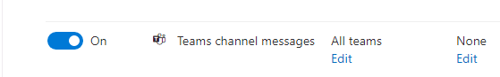
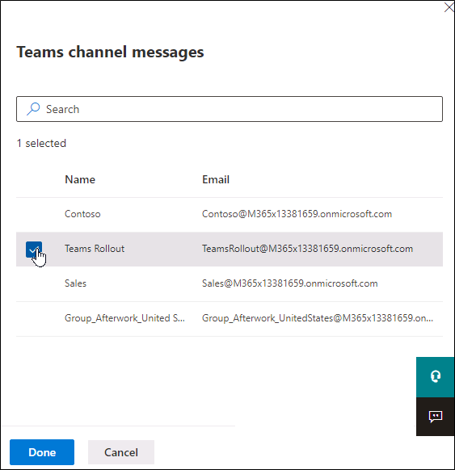
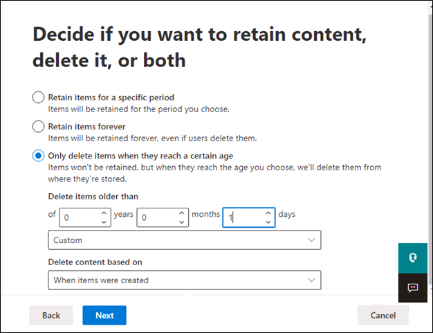
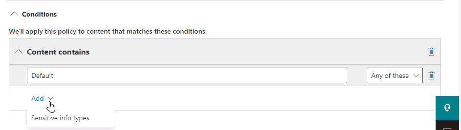
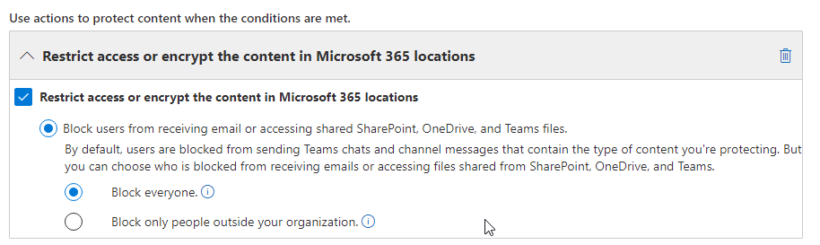

# **Lab 02: Prepare the environment for a Microsoft Teams deployment**

# **Student lab answer key**

## **Lab Scenario**

In the labs of this course, you will assume the role of the Global Administrator for Contoso Ltd. Your organization is planning to deploy Microsoft Teams. Before starting the deployment, the IT department is gathering business requirements about data security and compliance, including how the data shared in Teams be regulated according to the organization’s compliance requirements. Also there are concerns about the current network infrastructure to meet the requirements for Microsoft Teams services. Therefore, you need to analyze the current network infrastructure and perform bandwidth calculations. Based on your estimation, you can provide recommendations to the networking team.

After you complete the planning process, you will protect Teams from threats, and configure Teams to meet your organization’s compliance requirements.

 

## **Objectives**

After you complete this lab, you will be able to:

- Configure guest access in Azure and Teams

- Review Access to a resource

- Activate, create and assign sensitivity labels

- Activating Safe Attachments for SharePoint, OneDrive, and Teams

- Create, configure and test retention policies

- Create and test a DLP policy to protect GDPR content

- Calculate the network bandwidth capacity for a Teams deployment

- Work with the Microsoft 365 network connectivity test tool on a client

## **Lab Setup**

- **Estimated Time:** 120 minutes.

## **Instructions**

### **Exercise 1: Manage guest access for Microsoft Teams**

In this exercise, you will test the guest access features in Microsoft 365. To do so, you will configure guest access in Azure AD, add a new external guest user and revoke the guest access by using access reviews.

#### Task 1 - Review guest access settings (optional)

1. Connect to the **Client 1 VM** and browse to Azure AD admin center (https://aad.portal.azure.com/) as **MOD Administrator**.

2. In left navigation of the Azure AD admin center, select **Users**> **User settings** > **Manage external collaboration settings** under the External users. Review the following settings for external users at the Azure AD level:

	- **Guest user access**: Guest users have limited access to properties and memberships of directory objects.

	- **Guest invite settings**: Anyone in the organization can invite guest users including guests and non-admins (most inclusive).

	- **Collaboration restrictions**: Allow invitations to be sent to any domain (most inclusive)

3. Browse to Microsoft 365 admin center (https://admin.microsoft.com/) as **MOD Administrator**.

4. In the left navigation of the Microsoft 365 admin center, select the **Show all** and select **Settings** > **Org settings**.

	- Under the **Services** tab, select **Microsoft 365 Groups**. Make sure the checkbox is selected for **Let group owner add people outside your organization to Microsoft 365 Groups**. Close the **Microsoft 365 Groups** page by selecting **X** button.

	- Under the **Security &amp; privacy** tab, select **Sharing**. Make sure the checkbox is selected for **Let users add new guests to the organization**.

You have now reviewed guest access settings across different admin centers. You are ready to invite the guest for collaboration.

#### Task 2 - Configure guest access in Teams

Now that you have explored the Teams admin center it is time to configure the first setting. Since this task will take some time to replicate through the tenant, you will configure the guest user access for Microsoft Teams right now, so it is available for later use.

1. Connect to the **Client 1 VM** and browse to Teams admin center (https://admin.teams.microsoft.com) as **Joni Sherman** (JoniS@&lt;YourTenant&gt;.onmicrosoft.com).

2. In the left navigation of the Teams admin center, select **Users** > **Guest access**.

3. On the **Guest access** page, check if **Allow guest access in Teams** is enabled. If not, select **On**.

4. Scroll down and under **Messaging** section, disable **Delete sent messages**

5. Scroll down and select **Save**.

You have now successfully activated guest access and disallowed guests to delete their sent messages for Teams in your tenant.

#### Task 3 - Add a guest to a team

In this task, you will add a guest user by inviting the guest to the team **Group_Afterwork_United States** you created from Lab 1.

You will change the default settings for inviting/creating guest users and then add your personal Outlook.com account as a guest user to your tenant.

**Note**: You will need an Outlook.com account for this exercise. If you don’t have an outlook account, you can create a new account from [**https://outlook.com**](https://outlook.com/).

1. Connect to the **Client 2 VM** and open the **Teams desktop client** (https://teams.microsoft.com/) as **Alex Wilber** (AlexW@&lt;YourTenant&gt;.onmicrosoft.com)

2. Add the guest to **Group_Afterwork_United States** team.

	- Select **Teams** > Select **…** next to the **Group_Afterwork_United States** team.

	- Select **Add member** and enter your outlook account.

	- You will see a message **add &lt;Your outlook account&gt; as a guest**. Select the message and select **Add**.

3. Accept the guest invite

	- Open a **New InPrivate window** and check the email with subject **You have been added as a guest to Contoso in Microsoft Teams** from **Outlook Web Portal** (https://outlook.live.com/owa/).

	- Select **Open Microsoft Teams** from the email. You will be redirected to the sign-in page with a permission consent request.

	- Select **Accept** and sign in to Teams web client with your outlook account.

	- From the Teams client, select **Teams**, you will see the team **Group_Afterwork_United States**.

4. Test the guest access

	- Under the team **Group_Afterwork_United States**, select **General** channel, select **New conversation** and send the message: **Hello!**.

	- Select **…** of the message you just posted. Notice there’s no **Delete** option.

You have successfully invited a guest to a team and validated the guest access setting from the previous task.

#### Task 4 - Create access reviews

As a part of your system administrator role, you need to review access to resources in your tenant regularly. You can do that by creating an access review.

1. Connect to the **Client 1 VM** and browse to Azure AD admin center (https://aad.portal.azure.com/) as **MOD Administrator**. 

2. Create an access review to monitor guest users.

	In left navigation of the Azure AD admin center, select **All Services** and on right pane select **Identity Governance** > select the **Access Review** in the middle pane and select **+ New access review**. Follow the wizard with the following information:

	1. On the **Review type** tab:
	
		* In the **Select what to review** section, select **Teams + Groups**.
		* In the **Select review scope** section, select **All Microsoft 365 groups with guest users.** 
		* In the **Scope** section, select **Guest users only**. 
		* Select **Next: Reviews**.

	2. On the **Reviews** tab:
	 
		* In the **Select reviewers** section, select **Group owner(s)**.* In the **Specify recurrence of review** section, select **Weekly** and keep rest as default. 
		* Select on **Next: Settings**.

	3. On the **Settings** tab, leave the settings as default. Select on **Next: Review+Create** > **Create**. 

3. Review the access review dashboard from Azure AD.

	1. On the **Identity Governance | Access reviews** page, you will see an access review report named **Review guest access across Microsoft 365 groups**

	2. Wait for a few minutes, when the **Status** of the report shows as **Active**, select the name of the report - **Review guest access across Microsoft 365 groups**.

	3. On the **Review guest access across Microsoft 365 groups | Overview** page, select **Group_Afterwork_United States** under the group name.

	4. On the **Group_Afterwork_United States | Overview** page, you can see there is one user shown under **Not reviewed** category. 

4. Review the access review and approve the guest user. 

	1. Connect to the **Client 2 VM** and browse to the **Outlook.com** (https://outlook.office.com/) as **Alex Wilber** (AlexW@&lt;YourTenant&gt;.onmicrosoft.com). You can open an InPrivate window.

	2. Check the email with the subject **Action required: Review group access**.

	3. Select **Start review >** in the content of the email. 

	4. From the **My Access** (Https://myaccess.microsoft.com) page, select **Review guest access across Microsoft 365 groups**. 

	5. On the **Review guest access across Microsoft 365 groups** page, select the guest account and select **Approve**. 
	
	6. From the **Approve continued access** window, enter **Approved.** to the textbox, and select **Submit**

You have successfully created an access review and approved a guest user in your tenant.

### **Exercise 2: Implement security for Microsoft Teams**

In this exercise, you will increase the security level in your organization by configuring Safe Attachments to ensure that no malicious content is sent through documents shared in Teams by blocking attachments that contain malware.

#### Task 1 - Configure Safe Attachments for Microsoft Teams

Users in your organization are using Microsoft Teams for communication and collaboration. Business managers are concerned that documents that are shared within Microsoft Teams may contain malware. You will need to ensure that no malicious content is sent through documents shared in Teams by configuring Safe Attachments that block documents that contain malware.

1. Connect to the **Client 1 VM** and browse to Microsoft 365 Defender portal (https://security.microsoft.com/) as **MOD Administrator**.

2. In left navigation of the Microsoft 365 Defender portal, expand **Email & Collaboration** section, select **Policies &amp; rules** > **Threat policies** > **Safe Attachments** in the **Policies** section.

3. On the Safe attachments page, select **Global settings**.

4. In the Global settings flyout that appears, **Turn On** the toggle under **Turn on Defender for Office 365 for SharePoint, OneDrive, and Microsoft Teams**.

5. Select **Save**.

In this task, you have activated Safe Attachments scanning for SharePoint, OneDrive, and Microsoft Teams that block documents that contain malware.

### **Exercise 3: Implement compliance for Microsoft Teams**

Before deploying Microsoft Teams in your organization, you need to evaluate Microsoft Team’s compliance features to meet the organization’s requirements.

#### Task 1 – Activate sensitivity labels for Teams

You need to evaluate governance for Microsoft 365 Groups before deploying them in your organizations. In this task, you will activate the sensitivity labels for Teams in Azure AD, for being able to assign labels to teams.

1. Connect to the **Client 1 VM** with the credentials that have been provided to you.

2. Open **Windows PowerShell** and run as Administrator.

3. Connect to your AAD tenant.

    Enter the following cmdlet in the PowerShell window and press **Enter**. In the Sign-in window, sign in as the Global admin - MOD Administrator(admin@&lt;YourTenant&gt;.onmicrosoft.com).

    ```powershell
    Connect-AzureAD
    ```
4. Fetch the current group settings for the Azure AD organization

   ```powershell
   $Setting = Get-AzureADDirectorySetting -Id (Get-AzureADDirectorySetting | where -Property DisplayName -Value "Group.Unified" -EQ).id
   ```

5. Enable the Microsoft Identity Protection (MIP) support in your configuration:
    ```powershell
    $Setting["EnableMIPLabels"] = "True"
    ```
6. To verify the new configuration, run the following cmdlet:
    ```powershell
    $Setting.Values
    ```
7. Then save the changes and apply the settings:

	```powershell
	Set-AzureADDirectorySetting -Id $Setting.Id -DirectorySetting $Setting
	```
	**Note:** If there’s no directory settings object in the tenant yet. You need to use ```New-AzureADDirectorySetting``` to create a directory settings object for the first time.

8. Disconnects the current session from an Azure Active Directory tenant and closes the PowerShell window.

    ```powershell
    Disconnect-AzureAD
    ```

You have successfully changed your tenant’s Azure AD settings and activated sensitivity labels for Microsoft 365 Groups and Microsoft Teams.

#### Task 2 - Configure sensitivity labels for Teams

After activating sensitivity labels for groups, you will now create three sensitivity labels. In this task, you will create and update three sensitivity labels **General**, **Internal**, and **Confidential**. For each of them, you will create appropriate user and admin descriptions.

1. Connect to the **Client 1 VM** and browse to Microsoft Purview Portal https://compliance.microsoft.com/) as **MOD Administrator**.

2. In the left navigation of the Microsoft Purview compliance portal, select **Information protection** and select the **Labels** tab.

3. Select **Turn on now** next to the following warning message to activate content processing in Office online files.

	*Your organization has not turned on the ability to process content in Office online files that have encrypted sensitivity labels applied and are stored in OneDrive and SharePoint. You can turn it on here, but note that additional configuration is required for Multi-Geo environments. Learn more*

4. Update the first sensitivity label - **General**.

	Select the **General** label and select the **Edit label** button, follow the wizard with the following information and select **Next** after each step: 
	
	1. In the **Name &amp; description** section, enter the following information:
		- **Name**: Leave unchanged
		- **Display name**: General
		- **Description for users**: Leave unchanged
		- **Description for admins**: General information without encryption, marking or sharing restriction settings activated.

	2. In the **Scope** section, select **Items** and **Groups &amp; sites**.

	3. In the **Items** and **Auto-labeling** sections, leave the settings as default.
	
	4. In the **Groups & sites** section, select both checkboxes. 
	
		* **Privacy and external user access settings** 
		* **External sharing and Conditional Access settings** 

	5. In the **Privacy & external user access** section,
	
		* Select **None** under Privacy section.
		* Check the checkbox of **Let Microsoft 365 Group owners add people outside your organization to the group as guests** under External user access section. 

	6. In the **External sharing & conditional access** section,
	
		* Select **Control external sharing from labeled SharePoint sites** and select **Anyone**.

		* Select **Use Azure AD Conditional Access to protect labeled SharePoint sites** and select  **Allow full access from desktop apps, mobile apps, and the web**.

	7. In the **Schematized data assets (preview)** section, leave the settings as default and select **Next**.

	8. Select **Save label** > **Done**.

	9. On the **Choose sensitivity labels to publish** page, select **Cancel**.

5. Create the second sensitivity label - **Internal**.

	Select **+ Create a label**, follow the wizard with the following information and select **Next** after each step: 
	
	1. In the **Name & description** section, enter the following information:
		- **Name**: Internal
		- **Display name**: Internal
		- **Description for users**: Internal information with sharing protection
		- **Description for admins**: Internal information with moderate encryption, marking and sharing restriction settings activated

	2. In the **Scope** section, select **Items** and **Groups &amp; Sites** 

	3. In the **Items** section, select both checkboxes. 

		* **Encrypt items**
		* **Mark items**
	
	4. In the **Encryption** section, 

		* Select **Configure encryption settings**
		* Assign permissions now or let users decide: **Assign permissions now**.
		* User access to content expires: **Never**.
		* Allow offline access: **Always**.
		* Select **Assign permissions**, and select **+ Add all users and groups in your organization**.
		* Scroll down and select **Save** to apply the changes.
		

	5. In the **Content marking** sections, 

		* Select the slider and the checkbox **Add a watermark**.
		* Select **Customize text** and enter the following to the **Watermark text** box: **Internal use only**
		* Click **Save** to apply the changes.
		

	6. In the **Auto-labeling** section, leave the settings as default.
	
	7. In the **Groups & sites** section, select both checkboxes. 
	
		* **Privacy and external user access settings** 
		* **External sharing and Conditional Access settings** 

	8. In the **Privacy & external user access** section, select **None**. 

	9. In the **External sharing & device access** section
	
		* Select **Control external sharing from labeled SharePoint sites** and select **Existing guests**.

		* Select **Use Azure AD Conditional Access to protect labeled SharePoint sites** and select  **Allow limited, web-only access**.

	10. In the **Schematized data assets (preview)** section, leave the settings as default. 

	11. Select **Create label** > **Done**.

	12. On the **Choose sensitivity labels to publish** page, select **Cancel**.

6. Update the second sensitivity label - **Confidential**

	Select the **Confidential** label and select the **Edit label** button, follow the wizard with the following information and select **Next** after each step: 
	
	1. In the **Name & description** section, enter the following information:
		- **Name**: Leave unchanged
		- **Display name**: Confidential
		- **Description for users**: Leave unchanged
		- **Description for admins**: Confidential information with all restrictive encryption, marking and sharing settings activated

	2. In the **Scope** section, select **Items** and **Groups &amp; Sites** 

	3. In the **Items** section, select both checkboxes.

		* **Encrypt items**
		* **Mark items**
	
	4. In the **Encryption** section, 

		* Select **Configure encryption settings**
		* Assign permissions now or let users decide: **Assign permissions now**.
		* User access to content expires: **Never**.
		* Allow offline access: **Never**.
		* Select **Assign permissions**, and select **+ Add all users and groups in your organization**.
		* Scroll down and select **Save** to apply the changes.

	5. In the **Content marking** sections, 

		* Select the slider and the checkbox **Add a watermark**.
		* Select **Customize text** and enter the following to the **Watermark text** box: **Confidential.**
		* Click **Save** to apply the changes.

	6. In the **Auto-labeling** sections, leave the settings as default.
	
	7. In the **Groups & sites** section, select both checkboxes. 
	
		* **Privacy and external user access settings** 
		* **External sharing and Conditional Access settings** 

	8. In the **Privacy & external user access** section, select **Private**. 

	9. In the **External sharing & conditional access** section
	
		* Select **Control external sharing from labeled SharePoint sites** and select **Only people in your organization**.

		* Select **Use Azure AD Conditional Access to protect labeled SharePoint sites** and select **Block access**.

	10. In the **Schematized data assets (preview)** section, leave the settings as default. 

	11. Click **Save label** > **Done**.

	12. On the **Choose sensitivity labels to publish** page, select **Cancel**.


7. Publish sensitivity labels, after performing each step select **Next** (if required).

	1. On the **Information protection** page, select **label policies** tab.

	2. Select the **Global sensitivity label policy** and select the **Edit policy** button.

	3. In the **Choose sensitivity labels to publish** window, select the **Edit** Link.

	4. In the **Sensitivity labels to publish** window, check all labels and select **Add**.

	5. In the **Publish to users and groups** section, keep the default settings. 

	6. In the **Policy Settings** section, keep the default settings. 

	7. In the **Apply this a default label to documents** section, select **General** in the dropdown menu under **Apply this label by default to documents**.

	8. In the **Apply a default label to emails** section, select **General** in the dropdown menu under **Apply this label by default to emails**. 

	9. In the **Policy settings for Sites and Groups** section, select **General** in the dropdown menu under **Apply this label by default to groups and sites**.

	10. In the **Apply a default label to Power BI content (preview)** section, select **General** in the dropdown menu under **Apply this label by default to Power BI content**.	

	11. In the **Name** section, leave unchanged
	
	12. Select **Submit** > **Done**.

In this task, you have created and published three new sensitivity labels available for all users, which can be assigned to new and existing teams.

#### Task 3 - Assign sensitivity labels to teams

Once the sensitivity labels are created and published, users can now assign them to teams. Furthermore, users can modify assigned labels if needed. In this task, you will assign the **Internal** label to the **Teams Rollout** team.

**Note:** It can take several minutes till the newly created sensitivity labels are available to users.

1. Connect to the **Client 2 VM** with the credentials that have been provided to you.

2. Open the Teams Desktop client, where you are still signed in as **Alex Wilber**.

3. On the Teams overview select the **…** on the right side next to the Team "**Teams Rollout,"** then select **Edit team** from the dropdown list.

4. On the **Edit “Teams Rollout” team** window, select the dropdown menu below Sensitivity and select **Internal**.

5. Select **Done** to save the changes.

You have successfully applied a sensitivity label to an existing team. The configured settings of the Internal label are now applied to the Teams Rollout team. Continue with the next task.

#### Task 4 – Test external access with sensitivity labels (optional)

In this task, you will try to add a guest user to an internal team.

1. Connect to the **Client 2 VM** with the credentials that have been provided to you.

2. Open the Microsoft Teams Desktop Client, where you are signed in as **Alex Wilber**.

3. On the Teams overview select **…** right next to the Team "**Teams Rollout"** then select **Add member** from the dropdown list.

4. On the **Add members to Teams Rollout** page, enter the name of the guest user you just invited.

5. You will not be able to find the guest user, because guest users are restricted from this team.

6. Select **Close.**

You have successfully tested the sensitivity labels setting to prevent guest access to a protected team and you can confirm, the labels are working as predicted.

#### Task 5 - Create a new retention policy to retain content

Teams retention settings are very important for managing the lifecycle of company data, therefore, the capabilities of retention policies need to be evaluated in the Teams pilot. In this task, you will create a new retention policy that retains the Teams channel messages of the **Sales** team for **7 years** after the last modification.

1. Connect to the **Client 1 VM** and browse to Microsoft Purview Portal(https://compliance.microsoft.com/) as **MOD Administrator**.

2. In the left navigation of the Microsoft Purview Portal, select **Data lifecycle management**.

3. On the **Data lifecycle management** page, under **Retention policies** tab, select **+ New retention policy** to create a new retention policy. 

4. Follow the **Create retention policy** wizard with the following information:

	1. In the **Name** section, enter the following information 
		- **Name**: Sales retention policy
		- **Description**: Retention policy for Sales department that will retain channel messages for 7 years.
		- select **Next**

	2. In the **Type** section, select **Static** and select **Next** then configure the following settings:

		- **Exchange email**: Off
		- **SharePoint sites**: Off
		- **OneDrive accounts**: Off
		- **Microsoft 365 Groups**: Off
		- **Skype for Business**: Off
		- **Exchange public folders**: Off
		- **Teams channel messages**: On
		- **Teams chats**: Off
		- **Teams private channel messages**: Off
		- **Yammer community message**: Off
		- **Yammer user messages**: Off
		- Select **Edit** in the **Included** column (under the current *All teams* choice) for the **Teams channel messages** line to open the right-side pane.
		- Select the checkbox left from **Sales** and select **Done**.

			

	3. In the **Retention settings** section, select **Next**.


5. In the **Finish** section, review your settings and select **Submit**.

6. Select **Done**. Leave the browser open for the next task.

In this task, you have successfully created a new retention policy named **Sales retention policy** that retains the channel messages and chat of the **Sales** Team for **7 years after the last modification**.

#### Task 6 - Create a new retention policy to delete content

After configuring a retention policy to protect data from deletion, you also need to evaluate the capabilities of retention policies to delete content automatically. For demonstration purposes, you will set the deletion threshold to a single day and apply the retention policy to the **Teams Rollout** team, to remove all channel messages older than a day automatically.

1. Connect to the **Client 1 VM** and browse to Microsoft Purview Portal (https://compliance.microsoft.com/) as **MOD Administrator**.

2. In the left navigation of the Microsoft Purview Portal, select **Data lifecycle management**. From the drop down select **Microsoft 365**.

3. On the **Data lifecycle management** page, under **Retention** policies tab, select +New retention policy to add new Retention Policy. 

4. Follow the **Create retention policy** wizard with the following information:


	1. In the **Name** section, enter the following information 
	
		- **Name**: Teams Rollout deletion policy
		- **Description**: Retention policy for the Teams Rollout team to delete messages older than a day.
		- Select **Next**

	2. In the **Type** section,select **Static** and select **Next** then configure the following settings:

		- **Exchange email**: Off
		- **SharePoint sites**: Off
		- **OneDrive accounts**: Off
		- **Microsoft 365 Groups**: Off
		- **Skype for Business**: Off
		- **Exchange public folders**: Off
		- **Teams channel messages**: On
		- **Teams chats**: Off
		- **Teams private channel messages**: Off
		- **Yammer community message**: Off
		- **Yammer user messages**: Off
		- Select **Edit** in the **Included** column (under the current *All teams* choice) for the **Teams channel messages** line to open the right-side pane.
		- Select the checkbox left from **Teams Rollout** and select **Done**.

			

	3. In the **Retention settings** section, 
		- Select **Only delete items when they reach a certain age** 
		- Delete items older than: Select **Custom** > **1 days**
		- Delete the content based on: **when items were created**
		- Select **Next**.
		
			

6. In the **Finish** section, review your settings and select **Submit**.

7. Select **Done**. Leave the browser open for the next task.

You have successfully created a second retention policy for testing the deletion capabilities to clean up the **Teams Rollout** team from all conversation messages older than a day.

#### Task 7 – Test the retention policy for deleting content (optional)

In this task, you will test the retention policy for deleting content from the **Teams Rollout** team after a day. Before you can see the retention policy taking any effect, you must create some conversation content in the team.

**Note:** Because you need to wait for 24 hours till the retention policy deletes anything, this task is marked as optional. After creating content in the Teams Rollout team, you need to return to this task after waiting 24 hours to see the retention policy’s effect.

1. Connect to the **Client 2 VM** with the credentials that have been provided to you.

2. Open the Teams, desktop client, from the taskbar, where you are still signed in as **Alex Wilber**.

3. Select the **Teams Rollout** team and the **General** channel.

4. Select **New conversation** from the lower end of the main window.

5. Write the following text to the text box:

- Hello world!

6. Leave the client open and add other content to the team, as you like.

7. Come back after 24 hours to see, the content has been deleted automatically.

You have added a conversation message to a team, which is deleted by the deletion retention policy after 24 hours.

#### Task 8 - Create a DLP policy for GDPR (PII) content from a template

According to your organization’s compliance requirements, you need to implement basic protection of PII data for European users. You will create a new DLP Policy named **GDPR DLP Policy** from the template “General Data Protection Regulation (GDPR),” The DLP policy you create will detect if GDPR sensitive content is shared with people outside of your organization. If the policy detects at least one occurrence of the GDPR sensitive information, it will send an email to the **Teams admin - Joni Sherman** and block people from sharing the content and restricting access to shared content. Furthermore, it will display a tip to users who tried to share the sensitive content, and it will allow them to override the policy with business justification. Since you are evaluating the DLP policies, you will create the DLP policy in a test mode with policy tips enabled.

1. Connect to the **Client 1 VM** and browse to Microsoft Purview Portal (https://compliance.microsoft.com/) as **MOD Administrator**.

2. In the left navigation of the Microsoft Purview Portal, select **Data loss prevention** under **Solutions**.

3. On the **Data loss prevention** page, select the **Policies** tab, then select **+ Create policy**.

4. In the **Choose the information to protect** section,

	1. Select the **Search for specific templates** search box and type: **GDPR**.

	2. Select **Privacy** under **Categories**, then select the **General Data Protection Regulation (GDPR) Enhanced** template from the **Templates** section.

	3. Select **Next**

5. In the **Name your policy** section, enter the following information:

	- **Name**: GDPR DLP Policy

	- **Description**: Data loss prevention policy for GDPR regulations in Teams.

6. In the **Locations to apply the policy** section, apply the following settings and select **Next**:

	- **Exchange email**: On

	- **SharePoint sites**: On

	- **OneDrive accounts**: On

	- **Teams chat and channel messages**: On

	- **Microsoft Defender for Cloud Apps**: On

7. In the **Policy settings** section, stay with the default selection from the template - **Review and customize default settings from the template** and select **Next**.

	1. In the **Info to protect** section, leave the default settings and select **Next**.

	2. In the **Protection actions** section, ensure that the following settings are configured, and then select **Next**:

		- A checkbox is selected for: **Detect when a specific amount of sensitive info is being shared at one time**
		- In the **At least __ or more instances of the same sensitive info type** box, type: **1**
		- Select the checkbox **Send incident reports in email**
		- Select **Choose what to include in the report and who receives it** to open the right-side pane
		- Select **Add or remove people**, select the checkbox for **Joni Sherman**. 
		- Select **Add** and **Save**
		- Select the checkbox **Send alerts if any of the DLP rules match**
		- Select the checkbox **Restrict access or encrypt the content in Microsoft 365 locations**

	3. In the **Customize access and override settings** section, ensure that the following settings are configured, and then select **Next**:

		- A checkbox is selected for: **Restrict access or encrypt the content in Microsoft 365 locations**

		- Select **Block users from receiving email or accessing shared SharePoint, OneDrive, and Teams content**.

		- Select **Block only people outside your organization.**.

		- Select **Override the rule automatically if they report it as false positive**.

8. In the **Test or turn on the policy** section, select **Turn it on right away** and select **Next**.

9. On the Review your settings page, review your settings, select **Submit** then **Done**.

10. Stay on the **Data loss prevention page** and leave the browser opened.

After completing this task, you have created a DLP Policy from the template “General Data Protection Regulation (GDPR)” that detects if GDPR sensitive content is shared with people outside of your organization. The policy is extra sensitive for the configured threshold of **1** rule match and **Joni Sherman** will be notified if a matching occurs.

#### Task 9 - Create a DLP policy from scratch

After creating a DLP Policy for protecting GDPR relevant data, you will create another policy from scratch. Instead of using a template, you will configure rules directly with custom rules and actions.

1. Connect to the **Client 1 VM** and browse to Microsoft Purview Portal (https://compliance.microsoft.com/) as **MOD Administrator**.

2. In left navigation of the Microsoft Purview Portal, select **Data loss prevention** under **Solutions**.

3. On the **Data loss prevention** page, select the **Policies** tab, then select **+ Create policy**.

4. In the **Choose the information to protect** section,

	1. Select **Custom** under **Categories**, then select the **Custom policy** template from the **Templates** section.

	2. Select **Next**

5. In the **Name your policy** section, enter the following information:

	- **Name**: Credit card data DLP Policy

	- **Description**: Data loss prevention policy for credit card data in Teams.

6. In the **Locations to apply the policy** section, apply the following settings and select **Next**:

	- **Exchange email**: On

	- **SharePoint sites**: On

	- **OneDrive accounts**: On

	- **Teams chat and channel messages**: On

	- **Microsoft Defender for Cloud Apps**: On

	- **On-premises repositories**: Off

	- **Power BI**: Off

7. In the **Policy settings** section, stay with the default selection and select **Next**.


	1. In the **Customize Advanced DLP rules** section, select **+ Create rule** and enter the following information:
		- **Name**: Credit card numbers found
		- **Description**: Basic rule for protecting credit card numbers forms being shared in Teams.

	2. Below **Conditions**, 
		- Select **+ Add condition** and **Content contains**.
		- Leave the group name of **Default**, select **Add** and **Sensitive info types**.
		- From the right-side pane, check the box left of **Credit Card Number** and select **Add**.
		- Leave the high **High confidence** and **Instance count (1)** unchanged.

			

	3. Below **Action**, 
		- Select **+ Add an action** and **Restrict access or encrypt the content in Microsoft 365 locations**.
		- Select the checkbox of **Restrict access or encrypt the content in Microsoft 365 locations** again and select **Block everyone** 

			

	4. Below **User notification**, 
		- Select the slider to **On** 
		- Select **Notify the user who sent, shared or last modified the content**.
		- Select **Customize the policy tip text**.
		- Enter the following text to the textbox: **Credit card numbers are not allowed to be shared!**

	5. Below **Incident reports**, 
		- Set the slider **Send an alert to admins when a rule match occurs** to **Off**.
		- Select **Save**.
	
	6. Review the rule settings and select **Next**.

		
8. In the **Test or turn on the policy** section, select **Turn it on right away** and select **Next**.

9. On the Review your settings page, review your settings, select **Submit** then **Done**.

10. Leave the browser open.

You have successfully created a new custom DLP policy for protecting credit card numbers from being shared via Teams conversations.

#### Task 10 – Test the DLP Policies

To make sure your configured DLP policies are working as expected, you need to perform some testing with your pilot users.

**Note:** It can take up to 24 hours till new DLP policies take effect. If the step doesn’t work, continue with the lab, and perform a task at a later point of working through this lab.

1. Connect to the **Client 2 VM** with the credentials that have been provided to you.

2. Open the Teams desktop client from the taskbar, where you are still signed in as **Alex Wilber**.

3. In the left-hand navigation pane, select **Teams**, and then select the **General** channel below **Teams Rollout**.

4. Select **New conversation** from the main window.

5. Enter the following lines to the textbox:

	- MasterCard: 5105105105105100

	- Visa: 4111111111111111

	- Visa: 4012888888881881

6. Select the arrow to the right from the lower-right corner below the text box to send the message.

7. After a moment, you should see a text in red above your new conversation message that states, “**This message was blocked.**” **Select What can I do?** To see the reason why this message was blocked.

8. Select **Report** to notify the admin about this DLP policy violation. Now you can see a different message above your conversation entry, that states **Blocked.** **You’ve reported this to your admin.**

9. Connect to the **Client 1 VM** with the credentials that have been provided to you.

10. You should still be logged in to the **Microsoft Purview Portal**. If not, open Microsoft Edge, maximize the browser, and navigate to the **Microsoft Purview Portal**: [**https://compliance.microsoft.com**](https://compliance.microsoft.com/).

11. Select **Reports** from the left-hand navigation pane and scroll down to **Organizational data**.

12. Below **DLP Policy Matches** and **DLP Incidents**, you can now see the DLP policy matches. Select **DLP Policy Matches** to open the detailed view.

13. On the **DLP Policy Matches** page, inspect the rule matches.

You have successfully tested your DLP policy to block sharing of credit card information via Teams chat and channel conversations.

### **Exercise 4: Prepare network deployment**

Microsoft Teams provides users with chat, audio, video, and content sharing experience in different network conditions. It includes variable codecs, where media can be negotiated in limited bandwidth environments. However, as a Teams admin, you will need to carefully plan your network bandwidth, because there are other Office 365 services and third-party apps that also need a reliable network connection. Therefore, Teams admins must-have tools that could help to estimate the bandwidth consumption according to specific business requirements and existing network infrastructure and provide the best experience to business users.

#### Task 1 - Calculate network bandwidth capacity

In this exercise, you will calculate the network requirements for Microsoft teams, depending on your expected Teams usage business requirements. You must ensure enough bandwidth based on your organization network connectivity that is described in the following table:

| **Location**| **Total number of employees**| **WAN link capacity / audio/video queue size (Mbps)**| **Office 365 connection**| **Internet connection** |
| - | - | - | - | - |
| New York HQ| 1000 <br/><br/>(100 Specialized calling only employees)| 1000/300/500| ExpressRoute| Local Internet 1000 Mbps |
| Los Angeles Office| 250<br/><br/>(50 Specialized calling only employees)| 500/100/200| Remote connection through HQ| Remote Internet through HQ |
| Houston Office| 150<br/><br/>(50 Specialized calling only employees)| 400/50/100| Remote connection through HQ| Remote Internet through HQ |


Next, you will analyze your current bandwidth usage and test your network quality and connection to Microsoft Teams. You will also need to troubleshoot potential voice quality issues.

1. Connect to the **Client 1 VM** with the credentials that have been provided to you.

2. Sign in to the **Teams admin center** ([**https://admin.teams.microsoft.com**](https://admin.teams.microsoft.com/)) using **Joni Sherman** (JoniS@&lt;YourTenant&gt;.onmicrosoft.com).

3. Create a network plan
	
	1. On the left-hand navigation pane, expand **Planning**, and select **Network Planner**.

	2. On the **Network planner** page, under **Network plans** tab, select **Add** and create a network plan with the following information.

		- Network plan name: **Contoso plan**
		- Description: **Contoso Teams Network plan**
		- Select **Apply**.

4. Create a custom personas

	1. On the **Network planner** page, select **Personas** tab, and then select **+ Add**. 

	2. On the **Add persona** page, create a custom personas with the following information.

		- Persona name: **Calling only**
		- Description: **Specialized calling only employees**
		- Permissions: Turn on **Audio**
		- Select **Apply**.

	3. Note the default personas recommended by Microsoft.
	
5. Create network sites.

	1. Select the **Networks plans** tab, then select **Contoso plan**.
	2. Under **Network sites** tab, select **+ Add network site**. 
	3. Create a network site for **New York HQ** with the following information.

		- Network site name: **New York HQ site**
		- Description: **New York HQ site network infrastructure**
		- Network users: **1000**
		- Network settings - Subnet: **172.16.0.0**
		- Network settings - Network range: **16**
		- Turn **On** the **Express Route** button.
		- Internet link capacity: **1000**
		- PSTN egress: choose **Use VoIP only**
		- Select **Save**.

	4. Repeat the same steps to create a network site for **Los Angeles office** with the following information.

		- Network site name: **Los Angeles site**
		- Description: **Los Angeles site network infrastructure**
		- Network users: **250**
		- Network settings - Subnet: **192.168.10.0**
		- Network settings - Network range: **24**
		- Ensure **Express Route** button is **Off**.
		- Turn **On** the **Connected to WAN** button.
		- WAN link capacity: **500**
		- WAN audio queue size: **100**
		- WAN video queue size: **200**
		- PSTN egress: choose **Use VoIP only**
		- Select **Save**.

	5. Repeat the same steps to create a network site for **Houston office** with the following information.

		- Network site name: **Houston site**
		- Description: **Houston site network infrastructure**
		- Network users: **150**
		- Network settings - Subnet: **192.168.20.0**
		- Network settings - Network range: **24**
		- Ensure **Express Route** button is **Off**.
		- Turn **On** the **Connected to WAN** button.
		- WAN link capacity: **400**
		- WAN audio queue size: **50**
		- WAN video queue size: **100**
		- PSTN egress: choose **Use VoIP only**
		- Select **Save**.

6. Create a report
	
	1. On the **Contoso plan** page, select **Report** tab and then select **+ Add report**.

	2. Create a report with the following information.

		- Report name: **Contoso report**
		- Description: **Contoso network estimation report**
		- Under the **Calculation** section, specify the **Persona** and **Network users** with the following information.

			| **Network site**| **Persona** and **Network users**| 
			| - | - | 
			| New York HQ| Office Worker: 900 <br/><br/>Calling only: 100|
			| Los Angeles Office|Office Worker: 200 <br/><br/>Calling only: 50|
			| Houston Office|Office Worker: 100 <br/><br/>Calling only: 50|

	3. Select **Generate report**.

7. Under the **Reports** section, review the impact of Microsoft Teams on the Contoso network infrastructure by analyzing the report results on bandwidth needed for audio, video, screen sharing, Microsoft 365 traffic, and PSTN.

8. On the report page, select the **Chart view** at the upper-right hand corner to display report results in different views.

Once you generate the report, you’ll see the recommendation of your bandwidth requirements. The allowed bandwidth shows how much of your overall traffic is reserved for real-time communications. Thirty percent is the recommended threshold. By changing this value and selecting **Run report**, you can see the different impacts on the bandwidth for your network. Any areas that need more bandwidth will be highlighted in red. Work with your instructor to modify the parameters in the Network Planner and verify different results based on the input data.

In this lab, you have used Network Planner to estimate the Microsoft Teams impact on the bandwidth in your network infrastructure.

#### Task 2 - Use Microsoft 365 network connectivity test tool

You are in the planning phase of a Microsoft Teams deployment. Before deploying Microsoft Teams in your organization, you want to test your network quality and connection to Microsoft Teams. After completing the test, you will interpret the results and gain insights into potential network issues.

1. Connect to the **Client 1 VM** and browse to the [Microsoft 365 network connectivity test tool(https://connectivity.office.com)](https://connectivity.office.com?azure-portal=true) as **MOD Administrator**. 

2. Select **Sign in** at the top-right corner.

3. Specify the location and select **Run test**.

    You can type in your location by city, state, and country or you can have it detected from the web browser. 

4. Select **Open file** when prompted after downloading the advanced client test application.

	**Note**: The application requires .NET Core installed. Select **Yes** if you get prompted to install .NET Core. Select **Download x64** under **Run desktop apps** section then follow the installation instruction. 

5. Start the advanced tests client application - **Office 365 Network Onboarding Advanced Tests**.

	- Download the application
	- Navigate to downloads folder and run the client application

6. Once the client application starts, the web page will update to show this result.

7. Review the result under **Details** tab.

In this task, you have used Microsoft 365 network connectivity test tool to test the connectivity and connection quality of your network infrastructure for Microsoft Teams.

END OF LAB

 
