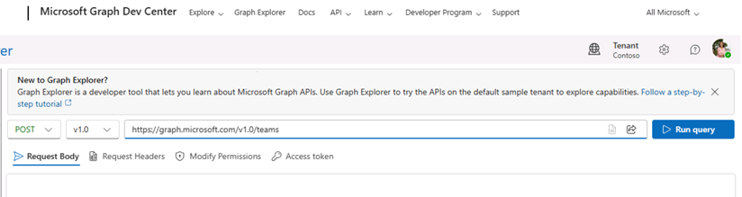
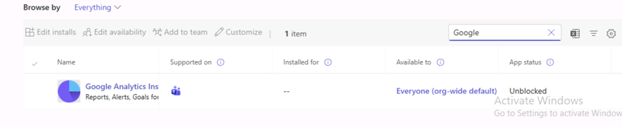

# **Lab 03: Manage teams, collaboration and app settings for Teams**

# **Student lab answer key**

## **Lab Scenario**

In the labs of this course, you will assume the role of Joni Sherman, a Teams Administrator for Contoso Ltd. In this lab, you will perform operational tasks as a Teams administrator, such as creating and modifying teams, managing membership, and recovering deleted teams.

In managing collaboration in Microsoft Teams, you will manage chat and collaboration experiences such as team settings or private channel creation policies. Finally, you will manage settings for Teams apps such as app permission and app setup policies, Apps, bots & connectors in Microsoft Teams or publish a custom app in Microsoft Teams.

## **Objectives**

After you complete this lab, you will be able to:

- Create a Team from a Microsoft 365 Group

- Create a Team by using PowerShell

- Create a Team by using Microsoft Graph API

- Create a Team with dynamic membership

- Archive and unarchive Teams

- Delete and recover Teams

- Create a messaging policy

- Manage private channels

- Disable third-party storage providers

- Manage Policy packages

- Edit and test default org-wide app policy

- Edit and test default app permission policy

- Create and manage a custom app setup policy

## **Lab Setup**

- **Estimated Time:** 110 minutes.

## **Instructions**

### **Exercise 1: Manage team resources**

#### Task 1 - Create a team from an existing Microsoft 365 group

As part of your pilot project for Contoso, you need to modify the **IT-Department** Microsoft 365 group, created in an earlier lab, and add Teams features to it.

1. Connect to the **Client 1 VM** with the credentials that have been provided to you.

2. Select the **Teams** icon on the taskbar to start the Teams desktop client and sign in as **Joni Sherman** (JoniS@&lt;YourTenant&gt;.OnMicrosoft.com).

3. The Microsoft Teams desktop client will start. If a **Bring your team together**, or **Get the Teams mobile app** window appears, close both windows.

4. In the left-hand navigation pane, select **Teams**, select **Join or create a team**, and then select **Create team** from the middle of the window.

5. In the **Create a team** dialog, select **From a group or team**.

6. In the **Create a new team from something you already own** dialog, select **Microsoft 365 group**.

7. In the **Which Microsoft 365 group do you want to use?** dialog, select the group **“IT-Department”**, then select **Create**. Wait until the **Creating the team…** process is done.

8. Select the three dots (**…**) right from the new team in the left pane and select **Manage team**.

9. Check the team owner and members:

	- Owners: **Joni Sherman**

	- Members and guests: **Allan Deyoung** , **MOD Administrator** and **Patti Fernandezr**

10. Leave the Teams desktop client open and continue to the next task.

You have successfully created a new team with the Teams desktop client, by using an existing Microsoft 365 group. Leave the Teams client open and continue with the next task.

#### Task 2 - Create a team by using PowerShell

In this task, you will create via the Teams PowerShell a new team **“CA-Office”**. You will create the public channels **“Support”** and **“Recruiting”**. Additionally, you will create the private channel **“Administration”** via Teams PowerShell.

1. Connect to the **Client 1 VM** with the credentials that have been provided to you.

2. On the taskbar at the bottom of the page, right select the **Start** button and then select **Windows PowerShell**.

3. Run the following cmdlet to connect to Microsoft Teams in your tenant:

    ```powershell
    Connect-MicrosoftTeams
    ```

4. A **Sign in** dialog box will open. Enter the **UPN** of **Joni Sherman’s** credential provided to you (for example, JoniS@&lt;YourTenant&gt;.onmicrosoft.com) and then select **Next**.

5. In the **Enter password** dialog box, enter the **password** of **Joni Sherman’s** credential provided to you and then select **Sign in**.

6. Type the following cmdlet to the PowerShell window to create the new team **CA-Office**:

    ```powershell
    New-Team -Displayname "CA-Office" -MailNickName "CA-Office" -Visibility Public
    ```

7. To add the user **Alex Wilber** to the team type the following cmdlet (Replacing <YourTenant> with the name of the Microsoft 365 Tenant provided to you.):

    ```powershell
    Get-Team -Displayname "CA-Office" | Add-TeamUser -User AlexW@<YourTenant>.OnMicrosoft.com
    ```

8. To add the user **Allan Deyoung** to the team type the following cmdlet (Replacing <YourTenant> with the name of the Microsoft 365 Tenant provided to you.):

    ```powershell
    Get-Team -Displayname "CA-Office" | Add-TeamUser -User AllanD@<YourTenant>.onmicrosoft.com
    ```

9. Create a channel **Support** in the **CA-Office** team by using the following cmdlet:

    ```powershell
    Get-Team -Displayname "CA-Office" | New-TeamChannel -DisplayName "Support"
    ```

10. Create another channel **Recruiting** in the **CA-Office** team by using the following cmdlet:

    ```powershell
    Get-Team -Displayname "CA-Office" | New-TeamChannel -DisplayName "Recruiting"
    ```

11. Create a private channel **Administration** in the **CA-Office** team by using the following cmdlet:

    ```powershell
    Get-Team -Displayname "CA-Office" | New-TeamChannel -DisplayName "Administration" -MembershipType Private
    ```

12. Disconnect from the Microsoft Teams environment.  

    ```powershell
    Disconnect-MicrosoftTeams
    ```

13. Close the PowerShell window.

14. Open the Teams desktop client from the taskbar. On the left side pane with all teams, Joni is a member of the new **CA-Office** team, where you can see a private channel below, named "Administration".

15. Close all browser windows and the Teams desktop client.

You have successfully created a team named **CA-Office** with the members Alex Wilber and Allan Deyoung. Joni Sherman is the only team owner. Note that you did not specify any owner in the PowerShell cmdlet and because it was run in the context of Joni, she was added as owner automatically. Furthermore, you have created the public channels named **Support** and **Recruiting**, as well as the private channel named **Administration**.

#### Task 3 - Create a team by using Graph API

In this task, you will test the Graph API capabilities for certain automation plans of your organization with Teams. For this task, you will create a new team, called **Early Adopters** with minimal settings, such as Public join options, and another team with multiple existing channels, called **Tech Meetings**.

1. Connect to the **Client 1 VM** with the credentials that have been provided to you.

2. Open Microsoft Edge, maximize the browser, and navigate to the **Graph Explorer** at: [https://developer.microsoft.com/graph/graph-explorer](https://developer.microsoft.com/graph/graph-explorer)

3. Select the **Sign in to Graph Explorer** button in the left of the page and sign in as **Joni Sherman** (JoniS@&lt;YourTenant&gt;.onmicrosoft.com).

4. If you access the Graph Explorer for the first time, you will see a **Permissions requested** page. Select **Accept**.

5. Select the **GET** button and select **POST** from the dropdown menu.

6. Do not change the **v1.0** from the box in the middle.

7. Enter the following to the text box before the **Run query** button:

	- [https://graph.microsoft.com/v1.0/teams](https://graph.microsoft.com/v1.0/teams)

8. Select **Modify permissions (Preview)** from the top pane.

	

9. Scroll to the right and select the **Consent** button for the permissions **Team.Create**.

10. Another **Permissions requested** page appears. Select **Accept**.

11. If you are redirected to the Microsoft Developers site, navigate back to the **Graph Explorer** at: [https://developer.microsoft.com/graph/graph-explorer](https://developer.microsoft.com/graph/graph-explorer)

12. Select the **Request body** tab and enter the following code:

    ```json
	{

	"template@odata.bind":"https://graph.microsoft.com/v1.0/teamsTemplates('standard')",

	"displayName": "Early Adopters",

	"description": "The Early Adopters Workspace.",

	"visibility": "Public" 

	}
	```

13. Select **Run** **query** from the upper right of the page.

14. After a moment, you should see a green bar below the Request body window, with a checkmark and an **Accepted** message.

15. Remove the whole content of the textbox in the textbox of **Request body**, you just used to create a team and replace it with the following content:

    ```json
	{

	"template@odata.bind": "https://graph.microsoft.com/v1.0/teamsTemplates('standard')",

	"visibility": "Public",

	"displayName": "Tech Meetings",

	"description": "Space for all employees participating in the champions program, who want exchange each other about the newest features.",

	"channels": [

	{

	"displayName": "Welcome Hall",

	"isFavoriteByDefault": true,

	"description": "Channel for introducing yourself as a member of the tech meeting participants."

	},

	{

	"displayName": "Tech Lunch and Dinner",

	"isFavoriteByDefault": true,

	"description": "When will be the next tech lunch and who has any suggestions where to meet."

	},

	{

	"displayName": "Q and A",

	"description": "Questions and answers: Teams users giving a helping hand to other users.",

	"isFavoriteByDefault": true

	},

	{

	"displayName": "Issues and Feedback 🐞",

	"description": "Leave some feedback for the IT-Staff.",

	"isFavoriteByDefault": false

	}

	],

	"memberSettings": {

	"allowCreateUpdateChannels": true,

	"allowDeleteChannels": false,

	"allowAddRemoveApps": true,

	"allowCreateUpdateRemoveTabs": true,

	"allowCreateUpdateRemoveConnectors": true

	},

	"guestSettings": {

	"allowCreateUpdateChannels": true,

	"allowDeleteChannels": false

	},

	"funSettings": {

	"allowGiphy": true,

	"giphyContentRating": "Moderate",

	"allowStickersAndMemes": true,

	"allowCustomMemes": true

	},

	"messagingSettings": {

	"allowUserEditMessages": true,

	"allowUserDeleteMessages": true,

	"allowOwnerDeleteMessages": true,

	"allowTeamMentions": true,

	"allowChannelMentions": true

	},

	"discoverySettings": {

	"showInTeamsSearchAndSuggestions": true

	}

	}
	```


16. Select **Run** **query** from the upper right of the page.

17. After a moment, you should see a green bar with a checkmark and **Accepted** inside again.

18. Open the Teams Desktop App. Select **Teams** and manage teams from the left-side pane and inspect the newly created teams “**Early Adopters"** and”**Tech Meetings**".

You have successfully created two teams via Graph API. Your test of the Graph functionality is complete, and you can advance to the next exercise.

#### Task 4 – Archive and unarchive a team

After creating the different teams in this lab, you also need to evaluate the different ways of removing teams again. In this task, you will test the archiving function and change the Sales team to a non-activate state without deleting its content. This function is required for some company’s compliance requirements of retaining the stored data inside the teams. The only Teams administrative role with sufficient privilege for this task is the Teams Administrator, which is currently assigned to Joni Sherman, therefore you will use Joni’s account for this task.

1. Connect to the **Client 1 VM** and browser to the **Teams admin center**: [https://admin.teams.microsoft.com](https://admin.teams.microsoft.com/) as **Joni Sherman** (JoniS@&lt;YourTenant&gt;.onmicrosoft.com).

2. Select **Teams** from the left-side pane and **Manage teams**.

3. Archive the **Sales** team

	1. Select the checkmark left from the **Sales** team and select **Archive** from the top pane.

	2. Select the checkbox of **Make the SharePoint site read-only for team members** and select **Archive**.

	3. The **Status** column should now have changed to **Archived**, written in orange color. Leave the browser open and proceed. If you have problems with the **Sales** team - archive another team (you can undo this action in the unarchive step).

4. Check the archived team

	1. Connect to the **Client 2 VM** and browse to the [**Microsoft Teams web client (https://teams.microsoft.com/)**](https://teams.microsoft.com/) as **Lynne Robbins** (LynneR@&lt;YourTenant&gt;.onmicrosoft.com).

	2. Select Teams and then select the gear icon(Manage Teams) next to **Join or create a team.**

	3. Expand **Archived** section, and select **Sales** team. You can see the **Sales** team under the **Hidden teams** section. 

	4. Select **General** channel under the **Sales** team, notice the **New conversation** option is not available.

5. Unarchive the **Sales** team

	1. Connect to the **Client 1 VM** again and browse to the Teams admin center as **Joni Sherman**.

	2. Select the checkbox left from **Sales** again and select **Unarchive** from the top menu. The **Status** field should change to **Active** again.

6. Check the unarchived team

	1. Connect to the **Client 2 VM** and browse to the [**Microsoft Teams web client (https://teams.microsoft.com/)**](https://teams.microsoft.com/) as **Lynne Robbins** (LynneR@&lt;YourTenant&gt;.onmicrosoft.com).

	2. On the left side, select **Teams**.

	3. Notice that the text of the **Sales** team and the **General** channel changes back to normal after a moment, but the team is hidden.

	4. Select the three dots (…) right from the Sales team and select **Show**.

7. Leave the browser open and stay signed in.

You have successfully archived a team and reviewed the limited functionality of archived teams. This fulfills the first requirement of testing the archiving function of teams for compliance preservation policies and rules. After this test, you have unarchived the team again, making it fully operational again.

#### Task 5 - Delete and recover teams

In this task, you will delete one of the teams created in the previous lesson and learn how to restore it.

1. Connect to the **Client 2 VM** and browse to the [**Microsoft Teams web client (https://teams.microsoft.com/)**](https://teams.microsoft.com/) as **Lynne Robbins** (LynneR@&lt;YourTenant&gt;.onmicrosoft.com).

2. In the left-hand navigation pane of the Teams web client, select the three dots (…) right from the **Sales** team and select **Delete the team** from the list.

3. In the **Delete the Sales team**, select **I understand that everything will be deleted**. and select **Delete team**.

4. Restore group

	1. Connect to the **Client 1 VM** and browse to Azure AD admin center (https://aad.portal.azure.com/) as **MOD Administrator**.

	2. On the left navigation pane, select **Azure Active Directory** > **Groups**.

	3. On the **Groups | All groups** page, select **Deleted groups** in the left side pane.

	4. Now you can see all deleted groups, including the **Sales** group.

	5. Select the checkbox left from the **Sales** group and select **Restore group** from the top pane. Confirm the **Do you want to restore deleted groups dialog** by selecting **Yes**.

5. Check the restored group.

	1. Connect to **Client 2 VM** and browse to the [**Microsoft Teams web client (https://teams.microsoft.com/)**](https://teams.microsoft.com/) as **Lynne Robbins** (LynneR@&lt;YourTenant&gt;.onmicrosoft.com).

	2. The **Sales** team appears in the list of teams again. Press **F5** to refresh the page if needed.

	3. Select the three dots (…) right from the team name and select **Manage team**. You can see the owner and all members again in the **Members** tab.

**Note:** The full process of deleting and restoring a team can take up to 24 hours. If it does not appear again, check for it at a later point in this lab.

You have successfully deleted a team via the Teams web client and restored it with the Azure Portal.

#### Task 6 - Manage team members with dynamic membership

Contoso is expanding to Canada and will open a new office in Toronto. As a system administrator, you need to configure a dynamic group with membership based on the location of the Office 365 services.

1. Connect to the **Client 1 VM** and browse to Azure AD admin center (https://aad.portal.azure.com/) as **MOD Administrator**.

2. On the left navigation pane, select **Azure Active Directory** > **Groups**.

3. On the **Groups | All groups** page, search and select **CA-Office** group.

4. On the **CA-Office** page, select **Properties** from the left-hand navigation pane.

5. Change the **Membership type** from **Assigned** to **Dynamic User**.

6. Select **Add dynamic query** below **Dynamic user members**.

7. On the **Dynamic membership rules** page, enter the following information to the fields:

	- Property: **accountEnabled**

	- Operator: **Equals**

	- Value: **true**

8. Select **+add expression** and enter the following information to the fields:

	- Property: **usageLocation**

	- Operator: **Equals**

	- Value: **CA**

9. Select **Save** twice.

	A warning message is displayed, that the membership will change according to the new dynamic membership rules. Select **Yes** to confirm the message.

11. Select **Overview** in the left-hand navigation pane of the **CA-Office** group window.

12. In the Overview window, locate **Dynamic rule processing status** field.

	Wait and refresh your browser, until the status says **Update complete**. It may take several minutes for the change to be processed.

13. Then select **Members** in the left-hand navigation pane and then select **Refresh**. Verify that **Alex Wilber** is in the list of members, but that **Allan Deyoung** has been removed from the group.

14. Select Owners from the left-hand navigation pane and verify, that Joni is still the Owner of the group, even if she does not match the dynamic group criteria.

You have successfully converted a Microsoft 365 group from static (assigned) to dynamic membership. This membership is controlled by the usageLocation of the user and if the account is enabled. Any user with the usageLocation “Canada” is added automatically to the team.

### **Exercise 2: Configure channel and message policies**

In this exercise, you will configure policies to manage the creation of new private channels and the available tools for users in chat.

#### Task 1 - Create a messaging policy for giphy, memes, and stickers

The company wants to restrict the use of graphic elements in Teams communication. As a Teams service administrator, you will create a new message policy that prohibits pilot users from using GIF files, memes, and stickers in the Teams chat and channel conversation.

1. Connect to the **Client 1 VM** and browse to Teams admin center (https://admin.teams.microsoft.com) as **Joni Sherman** (JoniS@&lt;YourTenant&gt;.onmicrosoft.com).

2. In the left navigation of the Teams admin center, select **Messaging policies**. 

3. Select **+Add** under **Manage Policies** tab and enter the following

	- **Name**: Regular users without fun stuff

	- **Description**: Policy to disable giphys, stickers, and memes in conversations

	- **Giphys in conversations**: Off

	- **Memes in conversations**: Off

	- **Stickers in conversations**: Off

	- Leave the rest of the settings as default. Select **Save**.

4. Back to the **Messaging policies** overview page, select the checkmark left to **Regular users without fun stuff**. Then select **Assign users** 

	**Note**: If you didn’t see **Assign users**, select … to expand the menu.

5. Search and select **add** for the following pilot users. Then select **Apply**.

	- **Alex Wilber**

	- **Lynne Robbins**

	- **Diego Siciliani**

**Note**: It can take up to 24 hours for the settings to take effect.

In this task, you have successfully configured a new messaging policy and assigned it to the pilot users. It will now take some time for the policy to take effect. Continue with the next task.

#### Task 2 - Manage private channels in a team

As Teams administrator of Contoso, you will create a private channel named **confidential** in the sales team that is only accessible for some team members.

1. Connect to the **Client 1 VM** and browse to Teams admin center (https://admin.teams.microsoft.com) as **Joni Sherman** (JoniS@&lt;YourTenant&gt;.onmicrosoft.com).

2. In left navigation of the Teams admin center, select **Teams** > **Manage teams**.

3. Select the **Sales** team > **Channels** tab.

4. Add the private channel

	1. Select **+ Add** from the top menu.

	2. In the **Add** window, enter the following information:

		- **Name**: Confidential sales

		- **Description**: Confidential private sales channel

		- **Type**: Private

		- **Channel owner**: Lynne Robbins

3. Select **Apply**.

5. Check the private channel

	1. Connect to the **Client 2 VM** and browse to the **Teams Web Client** [(https://teams.microsoft.com)](https://teams.microsoft.com/) as **Lynne Robbins** (LynneR@&lt;YourTenant&gt;.onmicrosoft.com).

	2. Select **Teams**, you should see the new private channel **Confidential sales** with a small padlock icon.

In this task, you learned how to create a private channel in the Microsoft Teams admin center and how to configure and check the access.

### **Exercise 3: Manage app settings**

#### Task 1 - Disable third-party storage providers

In the past, users stored data at various locations, including third-party storage providers. Recently, the company deployed OneDrive for all users and would like to guide the users to use SharePoint and OneDrive as the primary data storage locations with Box as an alternative for all file collaborations. As the Teams admin, you are asked to deactivate all third-party storage providers except Box in Microsoft Teams to align with the direction.

1. Connect to the **Client 1 VM** and browse to Teams admin center (https://admin.teams.microsoft.com) as **Joni Sherman** (JoniS@&lt;YourTenant&gt;.onmicrosoft.com).

2. In left navigation of the Teams admin center, select **Teams** > **Teams settings**.

3. On the **Teams settings** page, go to the **Files** section.

4. Configure the following file sharing and cloud file storage options.

	- **Citrix files:** Off

	- **DropBox:** Off

	- **Box:** On

	- **Google Drive:** Off

	- **Egnyte:** Off

5. Scroll down and select **Save**.

**Note**: It can take up to 24 hours for the settings to take effect.

In this task, you have learned how to enable or disable third-party storage providers for your whole tenant.

#### Task 2 - Block an app at organizational level

In this task, you will block the Google Analytics app for all tenants

1. Connect to the **Client 1 VM** and browse to Teams admin center (https://admin.teams.microsoft.com) as **Joni Sherman** (JoniS@&lt;YourTenant&gt;.onmicrosoft.com).

2. In the left navigation of the Teams admin center, select **Teams apps** > **Manage apps**.

3. On the **Manage apps** page, type **Google** in the search box. 

	

4. In the search result, select **Google Analytics** to highlight the app.

5. Select **Block** from the top menu.

6. Select **Block** again from the prompt window to confirm the setting.

**Note**: It can take up to 24 hours for the settings to take effect.

In this task, you have learned how to block the Google Analytics app for your tenant.


### **Exercise 4: Create and manage app setup policies**

As a Teams administrator you need to highlight the apps that are most important for your users and also showcase apps that users in your organization need, including apps built by third-parties or by parties or by developers in your organization.

#### Task 1 - Edit default org-wide app policy

In the pilot project, the company wants to add **Tasks by Planner and To Do** as the default app for all users. To do this, edit the default org-wide app policy. This task may take some time to propagate throughout the tenant.

1. Connect to the **Client 1 VM** and browse to Teams admin center (https://admin.teams.microsoft.com) as **Joni Sherman** (JoniS@&lt;YourTenant&gt;.onmicrosoft.com).

2. In the left navigation of the Teams admin center, select **Teams apps** > **Setup policies**.

3. On the **App setup policies** page, Under **Manage Policies,** select on **Global (Org-wide default)** to open the org-wide app policy.

4. In the **Pinned apps** section, select **Add apps**.

5. From the **Add installed apps** page, select **Global** and search **Planner**. You will see **Tasks by Planner and To Do** app, mouseover the name and select **Add** twice.

6. Make sure that **Tasks by Planner and To Do** is now listed in the **Pinned apps** section then select **Save**.

**Note**: It can take up to 24 hours for the settings to take effect.

In this task, you learned how to pin default apps from the Microsoft Teams admin center.

#### Task 2 - Create a custom app setup policy

1. Connect to the **Client 1 VM** and browse to Teams admin center (**https://admin.teams.microsoft.com**) as **Joni Sherman** ([**JoniS@&lt;YourTenant&gt;.onmicrosoft.com**](mailto:JoniS@&lt;YourTenant&gt;.onmicrosoft.com)).

2. In the left navigation of the Microsoft Teams admin center, go to **Teams apps** > **Setup policies**.

3. Select **+** **Add**. 

4. Enter the following information

	- Name: **Sales team**
	- Description: **Install Adobe Acrobat Sign and pin Viva Goals**.
	- User pinning: **On**
	- To install apps for users:

		1. Under **Installed apps**, select **Add apps**.
		2. In the **Add installed apps** pane, search for the apps you want to automatically install for users when they start Teams. 
		
			In this exercise search for **Adobe**, choose **Adobe Acrobat Sign** and select **Add** to add to the **Apps to add** list. 
			
			You can now select **Add** to finish adding the app under **Installed apps list.**

	- To pin apps:

		1. Under **Pinned apps**, select **Add apps**.

		2. In the **Add pinned apps** pane, search for **Viva Goals** and then select **Add**. 

		3. Select **Save.**  

5. Select **Save.**

You have now created a new custom app set up policy.

#### Task 3 - Assign a custom app setup policy to users

1. In the left-hand navigation pane on the **Microsoft Teams admin center**, go to **Teams apps** > **Setup policies**.

2. Select **Sales team** app setup policy.

3. Select **Assign users**.

4. In the **Manage users** pane, search for **Alex Wilber**, and then select **Add**.

5. Select **Apply**.

 
### **Exercise 5: Test configured policy settings**

In this exercise, you will test the configured policy settings on a client with the affected user **Lynne Robbins** and compare the settings to the available client settings of **Joni Sherman**.

#### Task 1 – Test the messaging policy and private channel access

In this task, you will test the **messaging policies** configured in exercise 1 and compare the difference between an affected user (Lynne Robbins) vs a regular user(Joni Sherman).

1. Connect to the **Client 2 VM** and browse the [**Microsoft Teams web client (https://teams.microsoft.com/)**](https://teams.microsoft.com/) as **Lynne Robbins** (LynneR@&lt;YourTenant&gt;.onmicrosoft.com).

2. In the left-hand navigation pane, select **Chat** > **New Chat** icon.

	

3. In the main pane, enter **Joni Sherman** to start the conversation.

4. Notice there’s no **giphy**, **memes** and **stickers** icons.

#### Task 2 – Test blocked app and storage providers

In this task, you will test the blocked app.

1. Connect to the **Client 2 VM** and browse the [**Microsoft Teams web client (https://teams.microsoft.com/)**](https://teams.microsoft.com/) as **Lynne Robbins** (LynneR@&lt;YourTenant&gt;.onmicrosoft.com).

2. In the left-hand navigation select **Apps**.

3. Search **Google** from the search box.

4. In the search results select **Google Analytics**. Note the lock icon and the "Request approval" button. 

5. In the left-hand navigation pane, select **Teams**, go to the **General** channel of the **Sales** team.

6. Select the **files** tab and select **+ Add cloud storage** in the navigation pane below.

	**Note**: You can reload the tab or select … if you didn’t see the option.

7. Notice that you only see SharePoint and Box as options, the cloud file storage settings in Teams settings worked as expected.

8. Sign out of Teams and close all open windows.

END OF LAB
